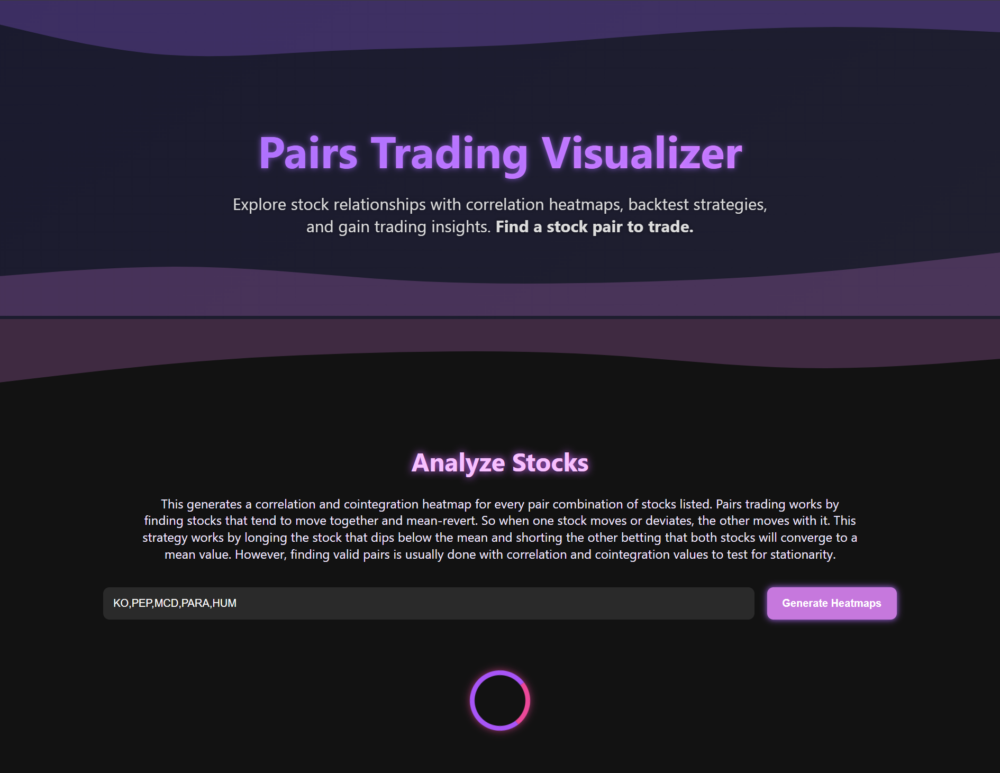

# 📈 Pairs Trading Web App

A full-stack application for identifying, visualizing, and backtesting pairs trading strategies using historical stock data from the Alpaca API.

### 🌐 Live Demo

🔗 [Check out the hosted app on Render](https://pairs-trading-analyzer.onrender.com/)

 <!-- Optional, add if you have one -->

---

## 🌟 Features

- Input a list of stock tickers and automatically:
  - Compute correlation and cointegration matrices
  - Display interactive heatmaps using Plotly
- Select highly correlated and cointegrated pairs for backtesting
- Visualize asset price history and performance (P&L)
- Full frontend/backend Docker setup
- Clean dark-themed UI inspired by DocuSign, with glowing purple and pink accents

---

## 🛠️ Technologies Used

### 🔙 Backend

- **Python**
- **FastAPI**
- **Uvicorn**
- **Pandas, NumPy, Seaborn, Plotly, Matlab, Statsmodels**
- **Alpaca API** for historical price data

### 🔜 Frontend

- **React.js**
- **Plotly.js**
- **CSS Modules**

### 🐳 Deployment

- **Docker & Docker Compose**

---

## 📦 Getting Started

### 🔧 Prerequisites

- Docker + Docker Compose installed
- Alpaca API Key & Secret (register at [Alpaca](https://alpaca.markets))

---

## 🚀 Run Locally with Docker

1. **Clone the repository**

   ```bash
   git clone https://github.com/your-username/pairs-trading-app.git
   cd pairs-trading-app
   ```

2. **Set up environment variables**

   Create `.env` files in the `backend/` and `frontend/` directories.

   **backend/.env**

   ```env
   ALPACA_API_KEY=your_key
   ALPACA_SECRET_KEY=your_secret
   ```

   **frontend/.env**

   ```env
   REACT_APP_BACKEND_URL=http://localhost:5000
   ```

3. **Build and run the containers**

   ```bash
   docker-compose up --build
   ```

4. **Open the app**
   ```
   http://localhost:3000
   ```

---

## 🧠 How It Works

1. User enters stock tickers in the UI

2. Backend fetches historical price data from Alpaca API

3. It calculates:

   - Pearson correlation matrix

   - Cointegration p-value matrix

4. The frontend displays interactive heatmaps using Plotly

5. Clicking a cell selects a pair and loads:

   - Normalized price comparison

   - Profit and loss time series

---

## 📁 Project Structure

    This is a mono-repo where the frontend and backend are together under the same directory.

    ```css
    project-root/
    ├── backend/
    │   ├── main.py
    │   ├── utils/
    │   ├── data/
    │   ├── results/
    │   └── requirements.txt
    ├── frontend/
    │   ├── public/
    │   ├── src/
    │   │   ├── components/
    │   │   └── App.js
    │   └── package.json
    ├── docker-compose.yml
    └── README.md
    ```

---

## 📬 Contact

Created by **Donte Truong**
📧 Email: [dontetruong@gmail.com](dontetruong@gmail.com)
🔗 LinkedIn: [https://www.linkedin.com/in/donte-truong-a95856363/](https://www.linkedin.com/in/donte-truong-a95856363/)

---

## 🛡 License

This project is licensed under the MIT License.
